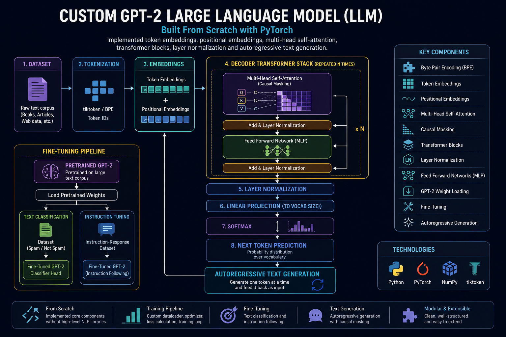
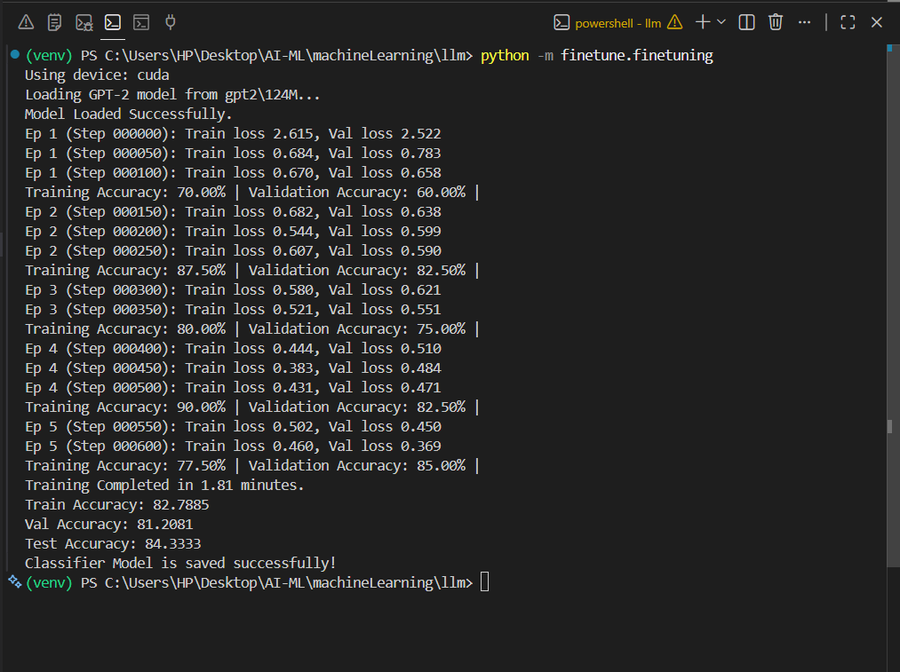
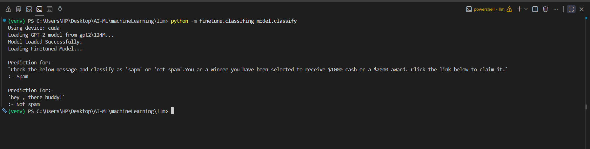
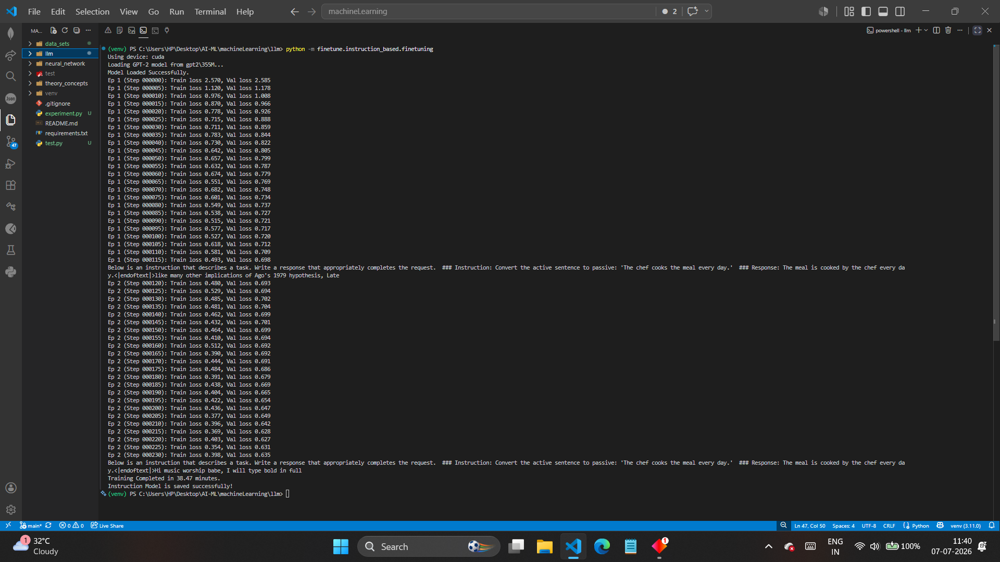
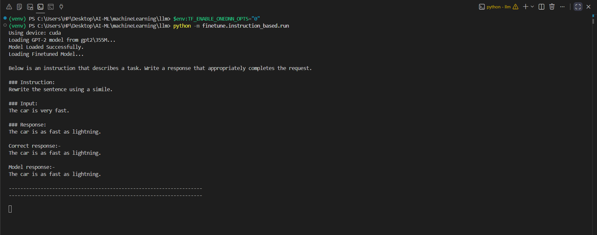

# Large Language Model From Scratch

A GPT-style Large Language Model implemented from scratch using PyTorch to understand how modern transformer-based language models are built, trained, and fine-tuned.

# Architecture

Complete archutecturen diagram of GPT-2 styled LLM.
*AI Generated*



## Goals

The objective of this project is to understand the internal workings of modern Large Language Models rather than simply using existing APIs or pretrained models.

Throughout the project, every major transformer component is implemented step by step, including attention mechanisms, transformer blocks, training pipelines, and fine-tuning workflows.

## Features

- Implemented GPT architecture from scratch using PyTorch
- Built tokenization and data loading pipeline
- Implemented Self-Attention and Multi-Head Attention
- Built Transformer Blocks and Feed Forward Networks
- Implemented causal masking
- Implemented positional embeddings
- Built autoregressive text generation
- Fine-tuned GPT-2 for text classification
- Fine-tuned GPT-2 for instruction following

## Fine-Tuning

In addition to building a GPT-style language model from scratch, this repository also explores transfer learning by fine-tuning pretrained GPT-2 models for:

- Text Classification
- Instruction Following

## Project Structure

```
LLM/
│
├── assets/
│   ├── classifier/ 
│   └── instruction/
│
├── core/
│   ├── attention.py
│   ├── dataloader.py
│   ├── loss_calculation.py
│   ├── text_token_converter.py
│   └── tokenizer.py
│
├── custom_llm/
│   ├── llm.py
│   ├── train_llm.py
│   └── train.py
│
├── finetune/
│   ├── classifing_model/
│   │   ├── accuracy_calculation.py
│   │   ├── classify.py
│   │   ├── dataloader.py
│   │   ├── finetuning.py
│   │   ├── loss_calculation.py
│   │   ├── train.py
│   │   └── upgrade_model.py
│   │
│   └── instruction_based/
│       ├── dataloader.py
│       ├── finetuning.py
│       └── run.py
│
├── gpt_architecture/
│   └── architecture.py
│
├── utils/
│   ├── gpt_downloader.py
│   ├── load_pretrain_gpt.py
│   └── raw_data.py
│
└── README.md
```

## Model Outputs

### Classifier Fine-Tuning

Training loss during GPT-2 fine-tuning for text classification.



---

### Classifier Prediction

Example predictions generated by the fine-tuned classification model.



---

### Instruction Fine-Tuning

Training progress while fine-tuning GPT-2 on instruction-following data.



---

### Instruction Generation

Example responses generated by the instruction-tuned model.



## Concepts Implemented

* Tokenization
* Byte Pair Encoding (BPE)
* Embeddings
* Positional Encoding
* Self-Attention
* Multi-Head Attention
* Transformer Blocks
* Language Modeling
* Text Generation

## Current Progress

* [x] Tokenization
* [x] Data Loading
* [x] Embeddings
* [x] Self-Attention
* [x] Multi-Head Attention
* [x] Transformer Block
* [x] GPT Model
* [x] Training
* [x] Text Generation

## Technologies

* Python
* PyTorch
* NumPy
* tiktoken

## Learning Objectives

- Understand the Transformer architecture from first principles.
- Learn how autoregressive language models generate text.
- Implement GPT components without relying on high-level libraries.
- Explore training, fine-tuning, and inference pipelines.
- Build an intuitive understanding of modern Large Language Models.

## Future Work

- Implement Flash Attention
- Add KV Cache for faster inference
- Implement LoRA fine-tuning
- Add Beam Search and Top-p Sampling
- Train on larger datasets
- Support distributed training

## Acknowledgements

This project is inspired by and follows concepts from **LLMs from Scratch** by **Sebastian Raschka**. The implementation is part of my personal learning journey and is intended to deepen my understanding of transformer-based language models.
