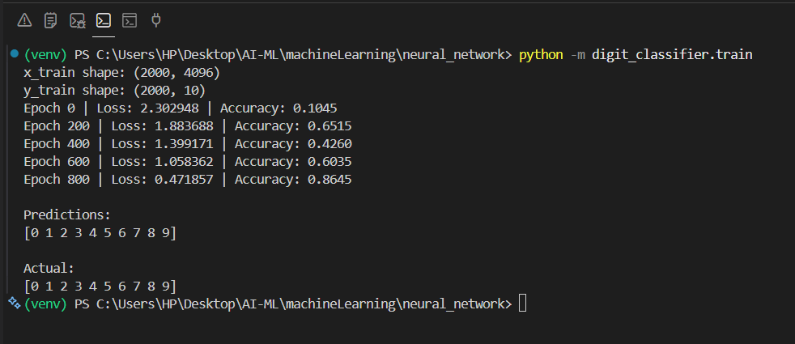
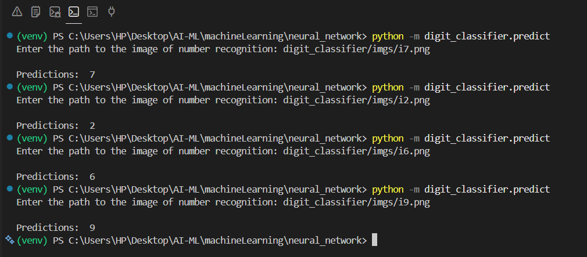

# Handwritten Digit Recognition

A handwritten digit recognition system implemented entirely from scratch using **Python** and **NumPy** without relying on deep learning frameworks such as TensorFlow or PyTorch.

## Overview

This project was built to understand the internal working of neural networks by implementing every major component manually.
The model classifies handwritten digits from **0–9** using a feedforward neural network trained on a custom dataset.

## Project Structure

```text
neural_network/
│
├── core/
│   ├── activation.py
│   ├── layer.py
│   ├── loss.py
│   └── soft_loss.py
│
├── digit_classifier/
│   ├── train.py
│   ├── predict.py
│   ├── digit_model.npz
│   └── imgs/
│
├── assets/
│   ├── training_output.png
│   └── prediction_output.png
│
└── README.md
```

## Features

* Dense Layers
* ReLU Activation
* Softmax Output Layer
* Cross-Entropy Loss
* Backpropagation
* Gradient Descent
* Model Serialization (.npz)

## Neural Network Architecture

```
Input Image (32 × 32)
        │
        ▼
Flatten
        │
        ▼
Dense Layer (64 Neurons)
        │
        ▼
ReLU
        │
        ▼
Dense Layer (10 Neurons)
        │
        ▼
Softmax
        │
        ▼
Predicted Digit
```

The model processes an input image through two fully connected layers with ReLU activation and produces a probability distribution over the ten digit classes using the Softmax activation function.

## Dataset

Instead of using the MNIST dataset, I created a custom handwritten dataset and expanded it using image preprocessing techniques.
The model was trained on approximately **100–200 augmented images per digit**, The dataset is available in the data_sets/digit_classifier_dataset.csv file.

## Training Output

The model was trained on a custom augmented handwritten digit dataset.



The loss decreased steadily during training while prediction accuracy improved.

## Prediction Example

The trained model correctly classifies handwritten digits from the custom dataset.



## Current Limitations

* Performs best on handwriting similar to the training data.
* Limited dataset size reduces generalization.
* Accuracy decreases on unseen writing styles and inverted color schemes.

## Future Improvements

* Larger dataset
* Data augmentation
* CNN implementation
* Better weight initialization
* Batch normalization

## Learning Outcomes

This project helped me understand:

* Forward Propagation
* Backpropagation
* Gradient Descent
* Weight Initialization
* Activation Functions
* Neural Network Training Pipeline

This project is part of my AI From Scratch learning journey.

## Technologies Used

- Python
- NumPy
- OpenCV
- Matplotlib

## Related Learning Resources

- 📘 Machine Learning Concepts (`theory_concepts/machine-learning-concepts.md`)
- 📘 Neural Network Concepts (`theory_concepts/neural-network-concepts.md`)
