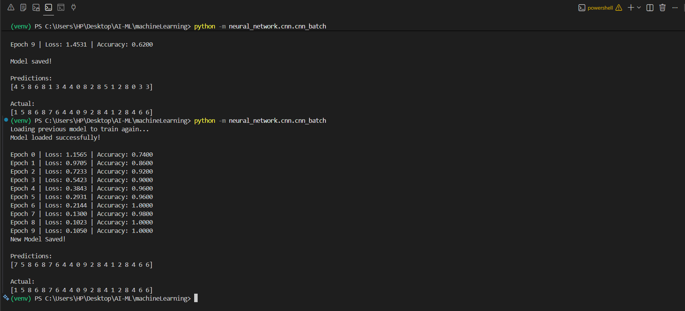

# Handwritten Digit Recognition using Convolutional Neural Network (CNN)

A handwritten digit recognition system implemented entirely from scratch using **Python** and **NumPy** without relying on deep learning frameworks such as TensorFlow, PyTorch, or Keras.

## Overview

This project extends my Neural Network from Scratch project by implementing a complete **Convolutional Neural Network (CNN)** from first principles.

Every layer—including convolution, pooling, activation functions, dense layers, forward propagation, backpropagation, and gradient descent—was implemented manually to gain a deeper understanding of how convolutional neural networks learn image features.

The model classifies handwritten digits from **0–9** using a custom dataset of handwritten images.

## Project Structure

```
cnn/
│
├── digit_classifier/
│   ├── train.py
│   └── predict.py
│
├── cnn_batch.py
│
├── cnn.py
│
└── README.md
```

## Features

* Convolution Layer (implemented from scratch)
* ReLU Activation
* Max Pooling Layer
* Flatten Layer
* Fully Connected (Dense) Layers
* Softmax Output Layer
* Cross-Entropy Loss
* Backpropagation through every layer
* Gradient Descent Optimization
* Model Saving & Loading (`.npz`)
* End-to-End CNN Training Pipeline

## CNN Architecture

```
Input Image (64 × 64)
        │
        ▼
Convolution Layer
(3 × 3 Kernels, 4 Filters)
        │
        ▼
ReLU
        │
        ▼
Max Pooling
(2 × 2)
        │
        ▼
Flatten
        │
        ▼
Dense Layer
(16 Neurons)
        │
        ▼
ReLU
        │
        ▼
Dense Layer
(10 Neurons)
        │
        ▼
Softmax
        │
        ▼
Predicted Digit
```

Unlike a traditional feedforward neural network, the CNN first extracts spatial features using convolution filters before passing the learned feature maps to fully connected layers for classification.

## Dataset

Instead of using the MNIST dataset, I created a custom handwritten digit dataset and expanded it using image preprocessing and augmentation techniques.

* Image Size: **64 × 64**
* Number of Classes: **10 (Digits 0–9)**
* Training Samples: **~4000 images**
* Test Samples: **20 images**
* Dataset Format: CSV

The dataset is available in: data_sets/digit_classifier_dataset_2.csv

## Training Output

The CNN was trained on the custom handwritten digit dataset using full-batch gradient descent.

During training:

* Cross-Entropy Loss decreased steadily.
* Model weights were updated using manually implemented backpropagation.
* Learned convolution filters extracted spatial features before classification.




## Implemented From Scratch

Unlike framework-based implementations, every major CNN component was built manually using NumPy, including:

* Forward Convolution
* Convolution Backpropagation
* ReLU Forward & Backward
* Max Pooling Forward & Backward
* Flatten Layer
* Dense Layers
* Softmax Activation
* Cross-Entropy Loss
* Gradient Descent
* Weight Updates
* Model Serialization

No TensorFlow, PyTorch, Keras, or other deep learning libraries were used to build the CNN itself.

## Current Limitations

* Trained on a relatively small custom dataset.
* Uses a shallow CNN architecture.
* Full-batch gradient descent results in slower convergence than mini-batch training.
* Performance decreases on handwriting styles significantly different from the training data.

## Future Improvements

* Mini-Batch Gradient Descent
* Multiple Convolution Layers
* Multi-Channel Feature Maps
* Batch Normalization
* Dropout Regularization
* Adam Optimizer
* Better Weight Initialization
* Data Augmentation
* GPU Acceleration (CuPy)
* Multi-Class Performance Evaluation
* Visualization of Learned Filters

## Learning Outcomes

This project helped me understand:

* Convolution Operations
* Feature Extraction
* CNN Forward Propagation
* CNN Backpropagation
* Gradient Flow through Convolution Layers
* Pooling Operations
* Weight Initialization
* Cross-Entropy Loss
* End-to-End CNN Training Pipeline
* Building Deep Learning Models from Scratch

This project is part of my **AI From Scratch** learning journey.

## Technologies Used

* Python
* NumPy
* Pandas
* OpenCV
* Matplotlib

## Related Projects

* Neural Network From Scratch
* GPT-2 Style Large Language Model From Scratch
* GPT-2 Fine-Tuning
* AI From Scratch

## Related Learning Resources

* 📘 Machine Learning Concepts (`theory_concepts/ML_CONCEPTS.md`)
* 📘 Neural Network Concepts (`theory_concepts/NN_CONCEPTS.md`)
* 📘 Convolutional Neural Network Concepts (`theory_concepts/CNN_CONCEPTS.md`)

## Framework Policy

This project intentionally avoids using TensorFlow, PyTorch, Keras, or any deep learning framework for implementing the CNN.

Only NumPy is used for numerical computations. Every layer, gradient computation, and parameter update is implemented manually for educational purposes.
